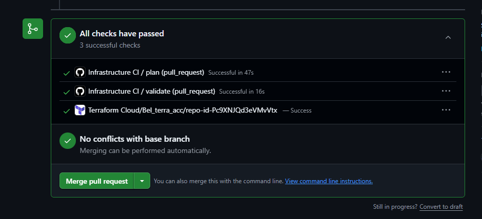
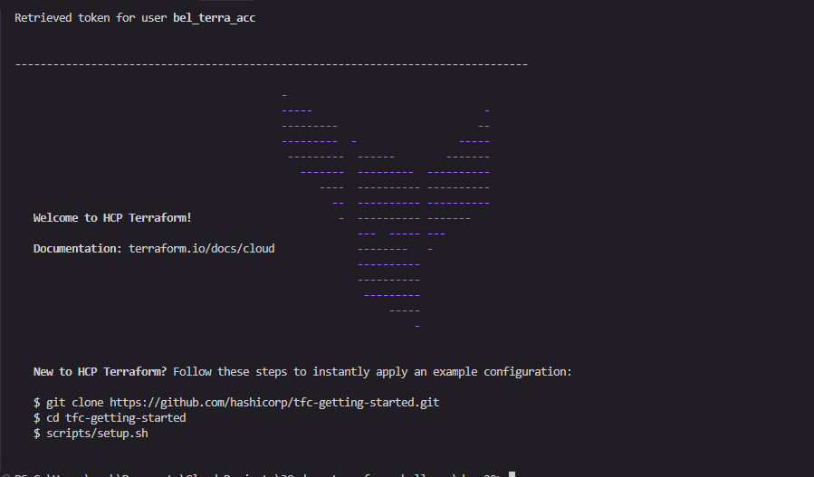
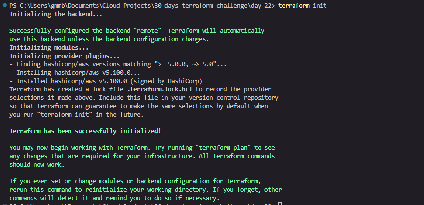
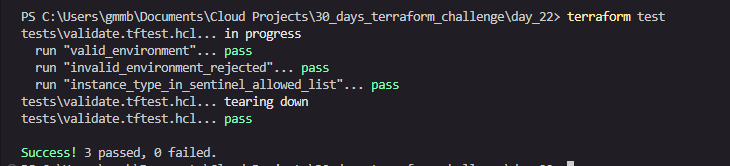
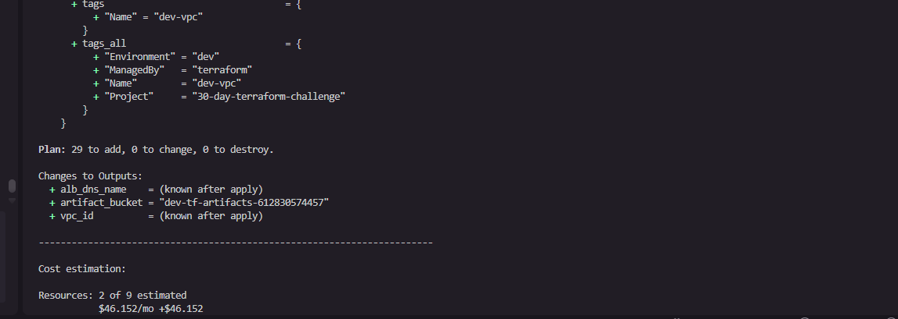
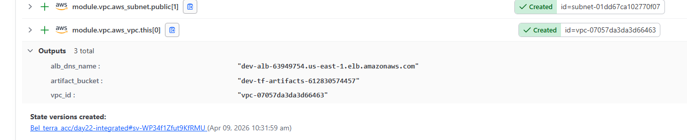
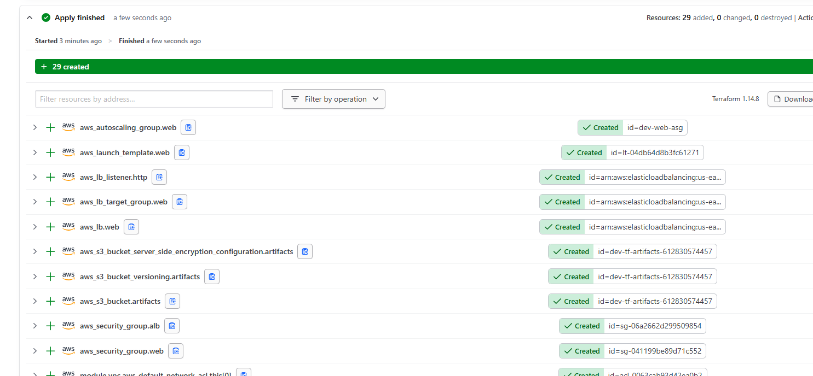
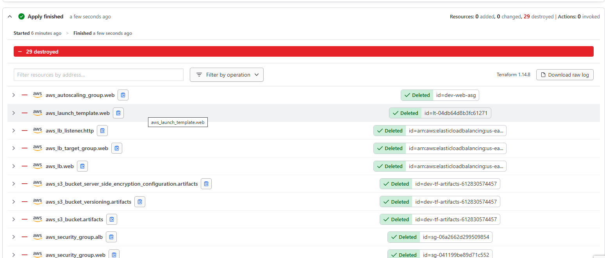
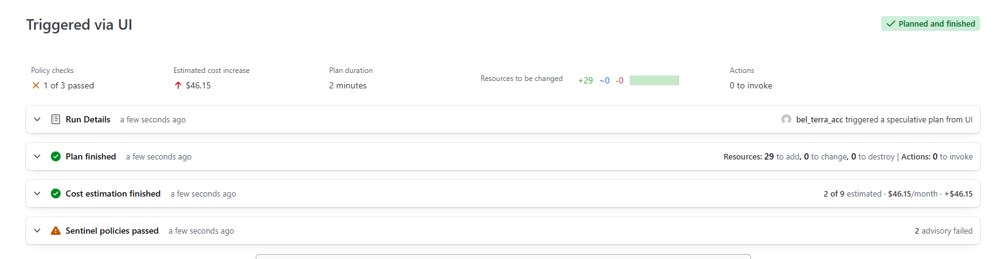

# Day 22 — Putting It All Together

## Project Structure

```
day_22/
├── .github/workflows/ci.yml          # Integrated CI pipeline
├── sentinel/
│   ├── allowed-instance-types.sentinel
│   ├── require-terraform-tag.sentinel
│   └── cost-check.sentinel
├── tests/
│   └── validate.tftest.hcl
├── images/                            # Screenshots
├── main.tf
├── variables.tf
└── outputs.tf
```

---

## Integrated CI Pipeline

The pipeline runs on every pull request targeting `main`. It is split into two jobs:

- `validate` — format check, init (no backend), validate, unit tests using mock providers. No AWS credentials needed.
- `plan` — full init against the Terraform Cloud remote backend, plan, upload the run summary as an artifact.

```yaml
name: Infrastructure CI

on:
  pull_request:
    branches: [main]

jobs:
  validate:
    runs-on: ubuntu-latest
    env:
      TF_CLI_ARGS: "-no-color"
    steps:
      - uses: actions/checkout@v4
      - uses: hashicorp/setup-terraform@v3
        with:
          cli_config_credentials_token: ${{ secrets.TF_API_TOKEN }}

      - name: Format check
        run: terraform fmt -check -recursive

      - name: Init
        run: terraform init -backend=false

      - name: Validate
        run: terraform validate

      - name: Unit tests
        run: terraform test

  plan:
    runs-on: ubuntu-latest
    needs: validate
    env:
      AWS_ACCESS_KEY_ID:     ${{ secrets.AWS_ACCESS_KEY_ID }}
      AWS_SECRET_ACCESS_KEY: ${{ secrets.AWS_SECRET_ACCESS_KEY }}
    steps:
      - uses: actions/checkout@v4
      - uses: hashicorp/setup-terraform@v3
        with:
          cli_config_credentials_token: ${{ secrets.TF_API_TOKEN }}

      - name: Init
        run: terraform init

      - name: Plan
        run: terraform plan -no-color

      - name: Upload plan summary
        uses: actions/upload-artifact@v4
        with:
          name: terraform-plan
          path: plan-summary.txt
```

### Passing Workflow Run

All steps in `validate` complete before `plan` starts (`needs: validate`). The CI pipeline passed on the PR from branch `day22-integrated-workflow` into `main`.



**GitHub Actions run:**
`https://github.com/Bel-94/day22-terraform-challenge/actions`

---

## Local Setup

### Terraform Login

Authenticated to Terraform Cloud using `terraform login` before running any commands locally.



### Terraform Init

Initialised the workspace with the remote cloud backend, downloading the VPC module and AWS provider.



### Local Terraform Test

Unit tests run with `terraform test` using mock providers — no AWS credentials required.



### Local Terraform Plan

Plan output showing 29 resources to add, streamed from Terraform Cloud back to the local terminal.



---

## Terraform Cloud Runs

All runs executed in the `day22-integrated` workspace in the `Bel_terra_acc` organization.

**Workspace URL:**
`https://app.terraform.io/app/Bel_terra_acc/workspaces/day22-integrated`

### Plan Run (CI triggered via PR)
`https://app.terraform.io/app/Bel_terra_acc/workspaces/day22-integrated/runs/run-PRvnidoxCnAgCPYt`

- Triggered by: GitHub PR merge to `main`
- Status: Policy checked ✅
- Sentinel policies: 3 evaluated, allowed-instance-types passed (hard-mandatory)



### Apply Run
`https://app.terraform.io/app/Bel_terra_acc/workspaces/day22-integrated/runs/run-8c1EKgazzeiWjrZX`

- Triggered by: UI (manual confirm)
- Status: Applied ✅
- Resources: 29 created



### Destroy Run
`https://app.terraform.io/app/Bel_terra_acc/workspaces/day22-integrated/runs/run-jqomHfKZ7HK9GT4Z`

- Triggered by: UI (destroy plan)
- Status: Applied ✅
- Resources: 29 destroyed — no lingering AWS charges



---

## Sentinel Policies

### 1. `allowed-instance-types.sentinel`

Blocks any `aws_instance` resource whose `instance_type` is not in `["t3.micro", "t3.small", "t3.medium", "t3.large"]`.

```python
import "tfplan/v2" as tfplan

allowed_types = ["t3.micro", "t3.small", "t3.medium", "t3.large"]

ec2_instances = filter tfplan.resource_changes as _, rc {
  rc.type is "aws_instance" and
  (rc.change.actions contains "create" or rc.change.actions contains "update")
}

main = rule {
  all ec2_instances as _, instance {
    instance.change.after.instance_type in allowed_types
  }
}
```

**Result: PASS (hard-mandatory)**

Why it matters: Without this, a developer can accidentally request a `p4d.24xlarge` in a PR and it will sail through `terraform validate` with no complaint. Sentinel catches it before the apply ever runs.

---

### 2. `require-terraform-tag.sentinel`

Blocks any apply where a taggable resource is missing `tags["ManagedBy"] = "terraform"`.

```python
import "tfplan/v2" as tfplan

taggable_resources = filter tfplan.resource_changes as _, rc {
  rc.change.after is not null and
  rc.change.after.tags else null is not null
}

main = rule {
  all taggable_resources as _, rc {
    (rc.change.after.tags else {}) contains "ManagedBy" and
    rc.change.after.tags["ManagedBy"] is "terraform"
  }
}
```

**Result: Advisory**

Why it matters: In a shared AWS account, manually created resources are invisible to Terraform. This policy makes the tag mandatory so every resource can be traced back to a specific workspace and module. Cost allocation and cleanup audits become trivial.

---

### 3. `cost-check.sentinel`

Blocks applies where the estimated monthly cost increase exceeds $50.00.

```python
import "tfrun"

maximum_monthly_increase = 50.0

main = rule when tfrun.cost_estimate is not null {
  float(tfrun.cost_estimate.delta_monthly_cost) < maximum_monthly_increase
}
```

**Result: Advisory**

Why it matters: Acts as a financial guardrail. Forces a human review and documented override before expensive infrastructure changes land in production.

---

## Cost Estimation Gate

Threshold: **$50.00 monthly increase per apply**.

| Resource | Monthly Cost |
|---|---|
| `aws_autoscaling_group.web` | $29.95 |
| `aws_lb.web` | $16.20 |
| **Total delta** | **$46.15/month** |

The $46.15 delta is **under the $50 threshold** — the cost-check policy passes. Terraform Cloud showed 2 of 9 resources estimated (7 resources such as security groups and S3 have no hourly cost).



---

## Side-by-Side Comparison Table

| Component | Application Code | Infrastructure Code |
|---|---|---|
| Source of truth | Git repository | Git repository |
| Local run | `npm start` / `python app.py` | `terraform plan` |
| Artifact | Docker image / binary | Saved `.tfplan` file |
| Versioning | Semantic version tag | Semantic version tag |
| Automated tests | Unit + integration tests | `terraform test` + Terratest |
| Policy enforcement | Linting / SAST | Sentinel policies |
| Cost gate | N/A | Cost estimation policy |
| Promotion | Image promoted across envs | Plan promoted across envs |
| Deployment | CI/CD pipeline | `terraform apply <plan>` |
| Rollback | Redeploy previous image | `terraform apply <previous plan>` |

The key insight: both columns are the same workflow. The only difference is the artifact type. Once you see that, you stop treating infrastructure as a special case and start applying every software engineering discipline you already know.

---

## Journey Reflection

### What I built

Over 22 days I deployed and managed:
- VPCs with public/private subnets, NAT gateways, route tables
- EC2 instances, launch templates, Auto Scaling Groups
- Application Load Balancers with target groups and health checks
- S3 buckets with versioning, encryption, and lifecycle policies
- IAM roles, policies, and instance profiles
- RDS instances with parameter groups and subnet groups
- EKS clusters with managed node groups
- Multi-region deployments with state isolation per region
- Terraform Cloud workspaces with remote state and variable sets
- Reusable modules versioned and tagged in Git
- GitHub Actions CI pipelines with plan artifacts
- Sentinel policies for governance

That list is longer than what most engineers build in their first year on the job.

### What changed in how I think

Before this challenge I thought about infrastructure as a sequence of steps — create this, then attach that. Now I think about infrastructure as a **state machine**. Terraform's job is to reconcile the desired state (code) with the actual state (reality). Every operation is a diff. That mental shift changes how I read error messages, how I design modules, and how I think about rollback — it is never "undo the last command", it is always "apply the previous desired state".

### What was harder than expected

State management in a team context. The mechanics of `terraform state` are straightforward. What is hard is the discipline around it — making sure every engineer understands that the state file is the source of truth, that manual changes in the console are invisible to Terraform until you import them, and that a corrupted or out-of-sync state file can block the entire team. The gap between "it works on my machine" and "it works reliably in CI with shared remote state" was bigger than I expected.

### What I would do differently

In week one I would set up the remote backend and CI pipeline on Day 1, before writing a single resource. I spent the first few days running `terraform apply` locally, which built bad habits around state and credentials. Starting with the pipeline forces you to think about the full workflow from the beginning, and every subsequent day's work lands in a better place.

### What comes next

The first real project: migrate a manually managed staging environment at work to Terraform. The VPC, security groups, and EC2 instances already exist — the work is importing them into state, writing the code to match, and then putting the whole thing behind a CI pipeline with Sentinel policies. Day 22 is exactly the blueprint for that.

---

## Chapter 10 Final Learnings

The single most important insight: **the artifact is the unit of promotion, not the code**.

Most teams run `terraform plan` in staging and then run `terraform plan` again in production. Those are two different plans. If anything changed between the two runs — a new AMI, a dependency update, a race condition — production gets something different from what was reviewed. The correct pattern is to save the plan as a binary artifact in CI, store it immutably, and apply that exact binary in every subsequent environment. The plan is the deployable unit, the same way a Docker image is the deployable unit for application code. That one change makes the entire workflow auditable, reproducible, and safe.

---

## Blog Post

**Title:** Putting It All Together: Application and Infrastructure Workflows with Terraform

**URL:** *(paste your published URL here)*

**Summary:** The post covers the integrated CI pipeline, the immutable plan artifact promotion pattern, the three Sentinel policies (instance types, mandatory tags, cost gate), and a genuine reflection on 22 days of building real infrastructure. The central argument is that application and infrastructure deployment are the same workflow — the only difference is the artifact type — and once you internalise that, every software engineering practice you already know applies directly to infrastructure.

---

## Social Media

**Post:** 🎉 Day 22 of the 30-Day Terraform Challenge — finished the book. Combined application and infrastructure deployment workflows into one integrated pipeline with CI, Sentinel policies, cost gates, and immutable plan promotion across environments. 22 days in and it is just getting interesting. #30DayTerraformChallenge #TerraformChallenge #Terraform #DevOps #IaC #AWSUserGroupKenya #EveOps

**URL:** *(paste your post URL here)*
